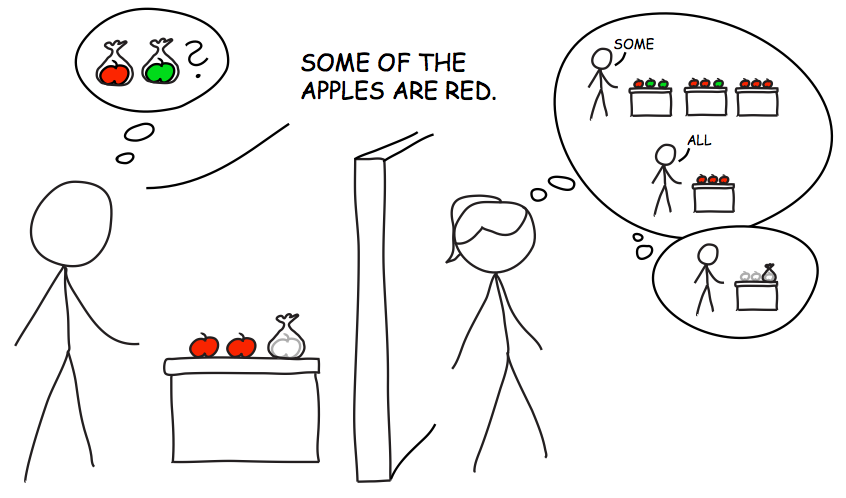

### Day 2: Enriching the literal interpretations

<!--   - Building the literal interpretations
  - Compositional mechanisms and semantic types
    - Functional Application; Predicate Modification 
  - The compositional semantics example from DIPPL -->

#### Scalar implicature

Scalar implicature stands as the poster child of pragmatic inference. Utterances are strengthened---via implicature---from a relatively weak literal interpretation to a pragmatic interpretation that goes beyond the literal semantics: "Some of the apples are red," an utterance compatible with all of the apples being red, gets strengthed to "Some but not all of the apples are red."  The mecahnisms underlying this process have been discussed at length. reft:goodmanstuhlmuller2013 apply an RSA treatment to the phenomenon and formally articulate the model by which scalar implicatures get calculated:

~~~~
// Here is the code from the basic scalar implicature model

// speaker optimality parameter
var alpha = 2;

// possible states of the world
var statePrior = function() {
  return uniformDraw([0, 1, 2, 3]);
};

// possible utterances
var utterancePrior = function() {
  return uniformDraw(['all', 'some', 'none']);
};

// meaning funtion to interpret the utterances
var literalMeanings = {
  all: function(state) { return state === 3; },
  some: function(state) { return state > 0; },
  none: function(state) { return state === 0; }
};

// literal listener
var literalListener = cache(function(utt) {
  return Infer({method:"enumerate"},
  function(){
    var state = statePrior();
    var meaning = literalMeanings[utt];
    condition(meaning(state));
    return state;
  })
});

// pragmatic speaker
var speaker = cache(function(state) {
  return Infer({method:"enumerate"},
  function(){
    var utt = utterancePrior();
    factor(alpha * literalListener(utt).score(state));
    return utt;
  });
});

// pragmatic listener
var pragmaticListener = cache(function(utt) {
  return Infer({method:"enumerate"},
  function(){
    var state = statePrior();
    factor(speaker(state).score(utt));
    return state;
  })
});

print("pragmatic listener's interpretation of 'some':")
viz.auto(pragmaticListener('some'));

~~~~

Capturing scalar implicature within the RSA framework might not induce waves of excitement. However, by implementing implicature-calculation within a formal model of communication, we can also capture its interactions with other pragmatic factors. Goodman and Stuhlmüller propose taking into account the listener's knowledge about the speaker's epistemic state: whether or not the speaker has full or partial knowledge about the state of the world (Fig. 3). 

Fig. 3: Example communication scenario from Goodman and Stuhmüller: How will the listener interpret the speaker’s utterance? How will this change if she knows that he can see only two of the objects?.

The intuition (which they validate experimentally) is that in cases where the speaker has partial knowledge (say, he knows about only two out of three relevant apples), the listener will be less likely to calculate the implicature (because she knows that the speaker doesn't have the evidence to back up the strengthened meaning).

~~~~
// Here is the code from the Goodman and Stuhlmüller speaker-access SI model

// red apple base rate
var baserate = 0.8

// state builder
var substatePriors = function() {
  var s1 = flip(baserate);
  var s2 = flip(baserate);
  var s3 = flip(baserate);
  return [s1,s2,s3];
}

// speaker belief function
var belief = function(actualState, access) {
  var fun = function(access,state,prior) {
    var sp = (substatePriors());
    return access ? state : _.sample(sp)
  }
  return map2(fun,access,actualState);
}

// state prior
var statePrior = function() {
  return substatePriors();
} 

// utterance prior
var utterancePrior = function() {
  uniformDraw(['all','some','none']);
}

// meaning funtion to interpret utterances
var literalMeanings = {
  all: function(state) { return all(function(s){s},state); },
  some: function(state) { return any(function(s){s},state); },
  none: function(state) { return all(function(s){s==false},state); }
};

// literal listener
var literalListener = cache(function(utt) {
  return Infer({method:"enumerate"},
               function(){
    var state = statePrior();
    var meaning = literalMeanings[utt];
    condition(meaning(state));
    return state;
  })
});

// pragmatic speaker
var speaker = cache(function(access,state) {
  return Infer({method:"enumerate"},
               function(){
    var utt = utterancePrior();
    var beliefState = belief(state,access);
    factor(literalListener(utt).score(beliefState));
    return utt;
  });
});

// tally up the state
var numTrue = function(state) {
  var fun = function(x) {
    x ? 1 : 0;
  }
  return sum(map(fun,state));
}

// pragmatic listener
var pragmaticListener = cache(function(access,utt) {
  return Infer({method:"enumerate"},
               function(){
    var state = statePrior();
    factor(speaker(access,state).score(utt));
    return numTrue(state);
  })
});

print("pragmatic listener for a partial-access speaker:")
viz.auto(pragmaticListener([true,true,false],'some'))
print("pragmatic listener for a full-access speaker:")
viz.auto(pragmaticListener([true,true,true],'some'))

~~~~

We have seen how the RSA framework can implement the mechanism whereby utterance interpretations are strengthened. Through an interaction between what was said, what could have been said, and what all of those things literally mean, the model delivers scalar implicature. And by taking into account awareness of the speaker's knowledge, the model successfully *blocks* implicatures in those cases where listeners are unlikely to access them. 

The models we have so far considered strengthen the litereal interpretations of our utterances: from "blue" to "blue circle" and from "some" to "some-but-not-all." Next, we consider what happens when we use utterances that are *literally* false. As we'll see, the strategy of strengthening interpretations by narrowing the set of worlds that our utterances describe will no longer serve to capture our meanings.

#### Hyperbole and the Question Under Discussion

If you hear that someone waited "a million years" for a table at a popular restaurant or paid "a thousand dollars" for a coffee at a hipster hangout, you are unlikely to conclude that the improbable literal meanings are true. Instead, you conclude that the diner waited a long time, or paid an exorbitant amount of money, *and that she is frustrated with the experience*. Whereas blue circles are compatible with the literal meaning of "blue," five-dollar coffees are not compatible with the literal meaning of "a thousand dollars." How, then, do we arrive at sensible interpretations when our words are literally false?

reft:kaoetal2014 propose that we model hyperbole understanding as pragmatic inference. Crucially, they propose that we add to the mix an awareness of **communicative goals**: what Question Under Discussion (QUD) a speaker is likely addressing with their utterance. To capture cases of hyperbole, Kao et al. observe that speakers are likely communicating---at least in part---about their attitude toward a state of the world (i.e., the valence of their *affect*). QUDs are modeled as summaries of the full world states, which take into account both state and valence information:

~~~~
var qudFns = {
  s : function(state, valence) {return state},
  v : function(state, valence) {return valence},
  sv : function(state, valence) {return [state, valence]},
  as : function(state, valence) {return approx(state, 10)},
  asv : function(state, valence) {return [approx(state, 10), valence]}
};
~~~~

~~~~
// Here is the code from the Kao et al. hyperbole model

// Define list of kettle prices under consideration (possible price states)
var states = [50, 51, 500, 501, 1000, 1001, 5000, 5001, 10000, 10001];

// Prior probability of kettle prices (taken from human experiments)
var statePrior = function() {
  return categorical([0.4205, 0.3865, 0.0533, 0.0538, 0.0223, 0.0211, 0.0112, 0.0111, 0.0083, 0.0120],
                     states)
};

// Probability that given a price state, the speaker thinks it's too
// expensive (taken from human experiments)
var valencePrior = function(state) {
  var probs = {
    50 : 0.3173,
    51 : 0.3173, 
    500 : 0.7920,
    501 : 0.7920, 
    1000 : 0.8933,
    1001 : 0.8933,
    5000 : 0.9524,
    5001 : 0.9524,
    10000 : 0.9864,
    10001 : 0.9864
  }
  var tf = flip(probs[state]);
  return tf //? 1 : 0
};

// Prior over QUDs 
var qudPrior = function() {
  return categorical([0.17, 0.32, 0.17, 0.17, 0.17],
                     ["s", "v", "sv", "as", "asv"])
};

var qudFns = {
  s : function(state, valence) {return state},
  v : function(state, valence) {return valence},
  sv : function(state, valence) {return [state, valence]},
  as : function(state, valence) {return approx(state, 10)},
  asv : function(state, valence) {return [approx(state, 10), valence]}
};

// Round x to nearest multiple of b (used for approximate interpretation):
var approx = function(x,b) {
  return b * Math.round(x / b)
};

// Define list of possible utterances (same as price states)
var utterances = states;

// Precise numbers are costlier
var utterancePrior = function() {
  categorical([0.18, 0.1, 0.18, 0.1, 0.18, 0.1, 0.18, 0.1, 0.18, 0.1],
              utterances)
};

// Literal interpretation "meaning" function; checks if uttered number
// reflects price state
var meaning = function(utterance, state) {
  return utterance == state;
};

// Literal listener, infers the qud value assuming the utterance is 
// true of the state
var literalListener = cache(function(utterance, qud) {
  return Infer({method : "enumerate"},
               function() {
    var state = statePrior()
    var valence = valencePrior(state)
    var qudFn = qudFns[qud]
    condition(meaning(utterance,state))
    return qudFn(state,valence)
  })
});

// Speaker, chooses an utterance to convey a particular value of the qud
var speaker = cache(function(qValue, qud) {
  return Infer({method : "enumerate"},
               function() {
    var utterance = utterancePrior()
    factor(literalListener(utterance,qud).score(qValue))
    return utterance
  })
});

// Pragmatic listener, jointly infers the price state, speaker valence, and QUD
var pragmaticListener = cache(function(utterance) {
  return Infer({method : "enumerate"},
               function() {
    var state = statePrior()
    var valence = valencePrior(state)
    var qud = qudPrior()
    var qudFn = qudFns[qud]
    var qValue = qudFn(state, valence)
    factor(speaker(qValue, qud).score(utterance))
    return {state : state, valence : valence}
  })
});

print("Pragmatic listener's interpretation of '$10,000':")
viz.auto(pragmaticListener(10000))

~~~~

In the [next chapter](3-semantics.html), we consider a different approach to approximating semantic composition within the RSA framework.